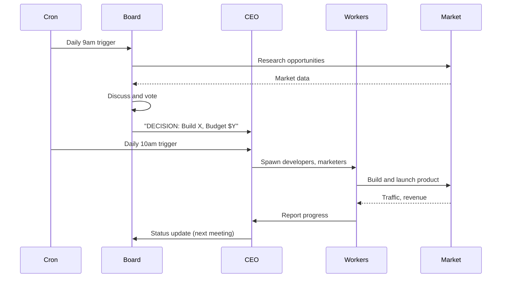

# AgentForge Quick Start (Board + CEO)

Goal: go from **zero** → **fully autonomous business builder** in minutes.

This guide sets up AgentForge with:
- **Board of Directors** (7 AI executives) that meet daily to research and vote on ventures
- **CEO Agent** that implements board decisions by spawning workers
- **Worker Agents** (developers, marketers, etc.) that execute
- **Autonomous loop** that runs 24/7 via cron

## What You Get

- Daily board meetings where Market Analyst researches real opportunities
- Autonomous venture selection (board votes on ONE business to build)
- CEO spawns developers and marketers to build and launch
- Real-time financial tracking with kill switches
- Zero human intervention required (oversight optional)

## Prerequisites

- Node `>=22`
- AgentForge repository cloned
- Model auth configured (Anthropic or OpenAI)
- Git installed

Optional but recommended:
- Stripe account (for payments)
- Vercel account (for deployments)
- Google Sheets (for financial tracking)

---

## Setup (Turnkey)

### 1. Install Dependencies

```bash
cd agentforge
pnpm install
```

### 2. Initialize AgentForge

```bash
# One command sets up everything:
# - Copies 7 board member + CEO workspaces
# - Registers all agents in config
# - Sets up board group session
# - Creates cron job templates
node moltbot.mjs init:agentforge
```

This creates:
- `~/.moltbot/agents/board/` (cfo, cto, cmo, coo, analyst, risk, innovation)
- `~/.moltbot/agents/ceo/`
- Config with all 8 agents registered
- Budget defaults ($50/day, $500/month)

### 3. Configure AI Provider

```bash
node moltbot.mjs auth choice
```

Choose Anthropic (Claude) or OpenAI. Recommended: Claude Sonnet 4.5 for best results.

### 4. Setup GitHub Access (CRITICAL!)

```bash
node moltbot.mjs setup:github
```

**Required for agents to build products.** Follow prompts to configure:
- Git identity (username, email)
- GitHub Personal Access Token
- Automatic testing

**Why:** Agents need GitHub to create repos, push code, and manage projects.

### 5. Setup Vercel Deployment (CRITICAL!)

```bash
node moltbot.mjs setup:vercel
```

**Required for agents to deploy products.** Follow prompts to configure:
- Vercel CLI installation
- Vercel auth token
- Automatic testing

**Why:** Agents need Vercel to deploy apps and make them publicly accessible.

### 6. Start Gateway

```bash
node moltbot.mjs gateway run --port 18789
```

---

## First Board Meeting

### Manual Trigger

```bash
./scripts/board-meeting.sh
```

### Watch Board Members Analyze

```bash
# Watch individual board members (pick any)
node moltbot.mjs tui --session agent:analyst:main      # Market research
node moltbot.mjs tui --session agent:cfo:main          # Financial analysis
node moltbot.mjs tui --session agent:cto:main          # Technical feasibility
```

### Watch Coordinator Synthesize

```bash
# Wait ~5 minutes for board members to respond, then:
node moltbot.mjs tui --session agent:coordinator:main
```

**What happens:**
1. All 7 board members receive role-specific prompts (in parallel)
2. Market Analyst browses web for real opportunities
3. Each member analyzes from their perspective (CFO: finances, CTO: tech, CMO: marketing, etc.)
4. Coordinator reads all 7 sessions
5. Coordinator synthesizes into "BOARD DECISION: Build [Product]. Budget: $X. Kill if: [threshold]. CEO: execute."

---

## CEO Execution

### Manual Trigger

```bash
./scripts/ceo-implement.sh
```

### Watch CEO Execute

```bash
node moltbot.mjs tui --session agent:ceo:main
```

**What happens:**
1. CEO reads board transcript
2. CEO spawns developer agent with product specs
3. CEO spawns marketer agent with launch plan
4. Workers build and deploy
5. CEO tracks spend/revenue in LEDGER.md
6. CEO reports results to board next day

---

## Autonomous Operation (Cron)

### Install Cron Jobs

```bash
# Add to crontab
crontab -e
```

Add these lines:

```cron
# Board meeting daily at 9am
0 9 * * * cd /path/to/agentforge && ./scripts/board-meeting.sh >> /tmp/board.log 2>&1

# CEO execution daily at 10am (after board)
0 10 * * * cd /path/to/agentforge && ./scripts/ceo-implement.sh >> /tmp/ceo.log 2>&1
```

Now the system runs itself:
- 9am: Board researches, discusses, votes
- 10am: CEO executes board decision
- Workers build and launch
- Next day: Repeat

---

## Monitor Progress

### View All Agents

```bash
node moltbot.mjs agents list
```

### Check Financial Ledger

```bash
cat ~/.moltbot/agents/ceo/LEDGER.md
```

Shows:
- Active investments
- Spend vs. budget
- Revenue
- ROI
- Kill threshold proximity

### Usage Dashboard

```bash
node moltbot.mjs dashboard
```

View real-time:
- Token usage
- Cost by agent
- Budget limits
- Spend alerts

---

## External Tools Setup

### Stripe (Payments)

```bash
# Install Stripe CLI
brew install stripe/stripe-cli/stripe

# Login
stripe login

# Get secret key
stripe keys list
```

Add to CEO's context: "Use Stripe secret key: sk_live_..."

For AgentForge config (so agents can see and use the keys), set:

```bash
cd ~/agentforge

# Live keys
node moltbot.mjs config set env.vars.STRIPE_SECRET_KEY "sk_live_..."
node moltbot.mjs config set env.vars.STRIPE_PUBLISHABLE_KEY "pk_live_..."

# (Optional) Test keys
node moltbot.mjs config set env.vars.STRIPE_TEST_SECRET_KEY "sk_test_..."
node moltbot.mjs config set env.vars.STRIPE_TEST_PUBLISHABLE_KEY "pk_test_..."

# Mode flag the agents can read
node moltbot.mjs config set env.vars.STRIPE_MODE "test"   # or "live"
```

### Vercel (Deployments)

```bash
# Install Vercel CLI
npm i -g vercel

# Login
vercel login
```

Workers can now deploy via `vercel deploy`.

### Google Sheets (Financial Tracking)

1. Create a Google Sheet
2. Share with service account email
3. Use `sheets-finance` skill to update

See [skills/sheets-finance/SKILL.md](../../skills/sheets-finance/SKILL.md) for setup.

---

## Board Member Personas

Bundled workspaces come with these personas:

### The Board (Strategy)

**Market Analyst** - Autonomous opportunity discovery
- Browses Reddit, Product Hunt, Twitter daily
- Scrapes competitor data
- Identifies 3-5 validated market gaps
- Presents with real data (pricing, reviews, complaints)

**CFO** - Financial strategy and capital allocation
- Analyzes P/L and ROI
- Recommends budget allocation
- Sets kill thresholds
- Protects downside

**CTO** - Technical feasibility
- Evaluates build complexity
- Estimates timeline
- Recommends tech stack
- Identifies technical risks

**CMO** - Marketing and customer acquisition
- Identifies target customers
- Plans go-to-market strategy
- Estimates CAC (Customer Acquisition Cost)
- Designs launch plan

**COO** - Operations and resources
- Plans resource allocation
- Identifies bottlenecks
- Manages timelines
- Ensures execution feasibility

**Risk Manager** - Downside protection
- Identifies risks
- Sets kill criteria
- Recommends diversification
- Prevents catastrophic losses

**Innovation Lead** - Emerging opportunities
- Tracks trends (AI, no-code, creator economy)
- Proposes unconventional ideas
- Advocates for experimental bets
- Pushes for 10x thinking

### CEO (Execution)

**CEO** - Board implementer
- Reads board decisions
- Spawns workers (developers, marketers)
- Monitors investments
- Executes kill switches
- Reports results to board

**Authority:**
- Can spend up to board-allocated budget
- Can spawn unlimited workers
- Can make tactical decisions
- Cannot change strategy (that's board's job)

---

## Investment Philosophy (Built-In)

The board operates on these principles:

1. **ROI-Driven** - Every investment needs 3x+ expected return
2. **No Sunk Cost** - Kill underperformers immediately per threshold
3. **Autonomous Research** - Market Analyst browses web during meetings
4. **Data-Based** - Decisions backed by competitor pricing, reviews, market size
5. **Continuous Reallocation** - Freed capital from killed investments goes to new ventures

---

## Kill Switch System

Every investment has clear kill thresholds:

**Examples:**
- "Kill if zero revenue after 30 days"
- "Kill if CAC > $100 after 100 customers"
- "Kill if churn > 50% month-over-month"
- "Kill if build takes > 10 days"

The system enforces these ruthlessly. No sunk cost fallacy.

---

## Example Flow

### Day 1 (9am): Board Meeting

1. Market Analyst: "I found 3 opportunities on Reddit..."
   - Email template tool (Lemlist competitor for indie hackers)
   - Notion template marketplace
   - TikTok repurposing SaaS

2. Board discusses each:
   - CTO: "Email tool is easy, 5 days build"
   - CMO: "Target r/SaaS, aim for Product Hunt top 5"
   - CFO: "Allocate $500, expect 3x ROI in 60 days"
   - Risk: "Kill if no revenue by day 30"

3. Board votes: "Build email template tool"

4. Board decision: "BOARD DECISION: Build EmailTemplates. Budget: $500. Timeline: 5 days. Kill if: no revenue by day 30. CEO: execute."

### Day 1 (10am): CEO Execution

1. CEO reads board decision
2. CEO spawns developer: "Build email template SaaS..."
3. CEO spawns marketer: "Create Product Hunt listing..."
4. CEO logs investment in LEDGER.md

### Days 2-5: Workers Build

- Developer builds MVP (Next.js + Supabase + OpenAI + Stripe)
- Developer deploys to Vercel
- Marketer creates launch assets

### Day 6: Launch

- Marketer launches on Product Hunt
- Marketer posts to r/SaaS, r/Entrepreneur
- CEO monitors traffic and signups

### Day 7-30: Monitor

- CEO checks revenue daily
- CEO updates LEDGER.md
- If approaching kill threshold: CEO alerts board
- If threshold hit: CEO kills investment immediately

### Day 31 (9am): Board Reviews Results

Board reviews:
- Spent: $450
- Revenue: $315 (21 customers × $15/mo)
- ROI so far: -30% (but only 1 month in)
- Decision: Continue for another month, or kill?

---

## Financial Tracking

CEO maintains `LEDGER.md` with:

### Active Investments

| ID | Product | Budget | Spent | Revenue | ROI | Kill Threshold | Days Remaining | Status |
|----|---------|--------|-------|---------|-----|----------------|----------------|--------|
| 001 | EmailTemplates | $500 | $450 | $315 | -30% | No revenue by Day 30 | 0 | At risk |

### Killed Investments

| ID | Product | Spent | Revenue | ROI | Reason | Lessons |
|----|---------|-------|---------|-----|--------|---------|
| - | - | - | - | - | - | - |

### Portfolio Summary

- Total invested: $450
- Total revenue: $315
- Portfolio ROI: -30%
- Win rate: 0/1 (too early)

---

## Recommended Next Steps

1. **Set up external tools** (Stripe, Vercel, Google Sheets)
2. **Install cron jobs** for daily board meetings
3. **Monitor first few cycles** to ensure smooth operation
4. **Set budget limits** via dashboard ($50/day default)
5. **Configure notification channel** (Slack/Discord) for alerts

---

## Human Interface System

AgentForge agents can request human help when blocked or need approval.

### How Agents Request Help

Agents use the `request_human` tool:

```bash
request_human \
  --priority urgent \
  --category access \
  --title "Need Stripe API keys" \
  --description "Building checkout, need production keys" \
  --suggestedAction "Set via: node moltbot.mjs config set..." \
  --timeout "2h"
```

### How to View Requests

**Via TUI:**
```bash
node moltbot.mjs tui --session agent:human:main
```

**Via Gateway API:**
```bash
# List all requests
curl http://localhost:18789 -X POST -H "Content-Type: application/json" -d '{
  "method": "human.requests.list",
  "params": {}
}'

# Get specific request
curl http://localhost:18789 -X POST -H "Content-Type: application/json" -d '{
  "method": "human.requests.get",
  "params": {"requestId": "REQ-XXXXX"}
}'
```

### How to Respond

**Via TUI:**
```bash
# In agent:human:main session, type:
RESPONSE REQ-XXXXX: APPROVED - Keys are sk_live_...
```

**Via Gateway API:**
```bash
curl http://localhost:18789 -X POST -H "Content-Type: application/json" -d '{
  "method": "human.requests.respond",
  "params": {
    "requestId": "REQ-XXXXX",
    "action": "approved",
    "response": "Keys are sk_live_..."
  }
}'
```

### Request Categories

- **approval** - Spending >$100, public posts, deployments
- **access** - API keys, credentials, external accounts
- **blocked** - Stuck on task >2 hours
- **critical** - Legal, compliance, high-risk decisions

### Request Priorities

- **urgent** - Needs response within 2 hours
- **high** - Needs response within 12 hours
- **medium** - Needs response within 24 hours
- **low** - Needs response within 72 hours

---

## Troubleshooting

### Board not selecting a venture

**Likely cause:** Market Analyst not doing web research

**Fix:** Check that `browser` tool is working:
```bash
node moltbot.mjs agent --message "Use browser tool to visit reddit.com and tell me the top post"
```

### CEO not spawning workers

**Likely cause:** Board decision unclear

**Fix:** Check board transcript has "BOARD DECISION: ..." format

### Workers not making progress

**Likely cause:** Missing external tools (Vercel CLI, etc.)

**Fix:** Install required tools and verify they work:
```bash
vercel --version
stripe --version
```

---

## Related Skills

- [`invest-capital`](../../skills/invest-capital/SKILL.md) - Investment framework
- [`sheets-finance`](../../skills/sheets-finance/SKILL.md) - Financial tracking
- [`stripe`](../../skills/stripe/SKILL.md) - Payment integration
- [`vercel`](../../skills/vercel/SKILL.md) - Deployment
- [`browser-automation`](../../skills/browser-automation/SKILL.md) - Web research

---

## Architecture Diagram



---

1. **Monitor first board meeting** - Watch Market Analyst research
2. **Verify CEO execution** - Check that workers are spawned
3. **Set up external tools** - Stripe, Vercel, Google Sheets
4. **Configure budget alerts** - Via dashboard
5. **Let it run** - Autonomous operation requires no intervention

---

## FAQ

### Can I override board decisions?

Yes - you're the LP. The board is your GP. But the goal is autonomous operation, so overrides should be rare.

### What if the board picks a bad idea?

The kill switch system protects you. Bad investments get terminated quickly per threshold.

### How much capital should I start with?

Start small ($100-500 total budget). Scale up as the system proves itself.

### Can I have the board meet more frequently?

Yes - edit the cron schedule. But daily is recommended to give CEO time to execute.

### Can I add more board members?

Yes - create additional workspaces and add to the board group in config.

---

## Comparison: Old CEO vs. New Board + CEO

| Aspect | Old (Single CEO) | New (Board + CEO) |
|--------|------------------|-------------------|
| Strategy | CEO decides | Board decides via discussion |
| Research | CEO does it | Market Analyst specialized role |
| Risk Management | CEO judgment | Dedicated Risk Manager |
| Technical Feasibility | CEO estimates | CTO specialized analysis |
| Marketing | CEO plans | CMO specialized expertise |
| Decision Quality | One perspective | 7 specialized perspectives |
| Autonomous Ideation | Limited | Market Analyst browses web daily |

---

## Advanced: Customizing Board Members

Each board member's `SOUL.md` can be customized:

```bash
# Edit a board member's persona
nano ~/.moltbot/agents/board/analyst/SOUL.md
```

Examples:
- Make Market Analyst focus on specific industries (SaaS, crypto, etc.)
- Adjust CFO's risk tolerance (more conservative or aggressive)
- Give CTO preference for specific tech stacks
- Tune Risk Manager's kill thresholds

---

## System Requirements

- **CPU:** Any modern CPU (multi-core recommended for parallel workers)
- **RAM:** 4GB minimum, 8GB+ recommended
- **Storage:** 10GB+ for codebase, builds, and sessions
- **Network:** Stable connection for web research and API calls
- **OS:** macOS, Linux, or WSL2 on Windows

---

## Cost Expectations

With default budget ($50/day, $500/month):

**Token Usage:**
- Board meeting: ~50K tokens (~$0.15-0.50 depending on model)
- CEO execution: ~20K tokens (~$0.06-0.20)
- Workers: Variable based on task

**Monthly estimate:** $50-200 in API costs with moderate activity.

Use the dashboard to monitor real-time spend.

---

## Related Documentation

- [Autonomous Agents](/concepts/autonomous-agents) - Detailed agent patterns
- [Sub-agents](/tools/subagents) - Worker spawning mechanics
- [Heartbeat](/gateway/heartbeat) - Scheduling and cron
- [Budget System](/configuration/budget) - Spending limits and alerts
- [Skills](/tools/skills) - Available capabilities

---

## Support

- **Discord:** [discord.gg/clawd](https://discord.gg/clawd)
- **Docs:** [docs.molt.bot](https://docs.molt.bot)
- **GitHub:** [github.com/moltbot/moltbot](https://github.com/moltbot/moltbot)

---

**Let the board meet. Let the CEO execute. Let the workers build.**

**Autonomous. Relentless. Profitable.**

## Session Startup

Before any action:
1. Read SOUL.md — remember who you are
2. Read MEMORY.md — your long-term knowledge
3. Check HEARTBEAT.md — pending tasks and priorities

## Spawning Sub-Agents

Use `sessions_spawn` with full context injection:

```
sessions_spawn task:"You are a [ROLE] Agent.

=== BUSINESS CONTEXT ===
Project: [Name]
Status: [Current state]
Repo: [URL if applicable]
